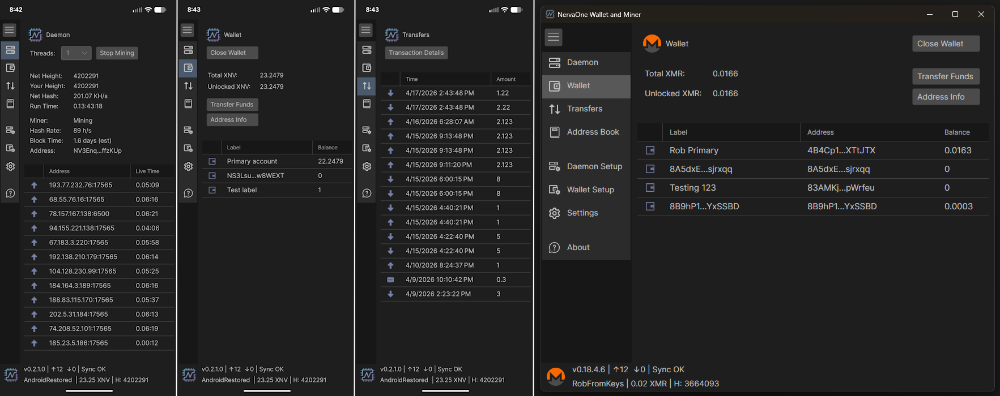
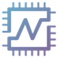

# 🏛️ NervaOne Wallet and Miner



---

[][actions]
[][releases-link]
[][license]
[][issues]
[][releases-link]
[][deep-wiki]

---

## ⓘ About NervaOne

**NervaOne** is an open-source, non-custodial Wallet and CPU Miner for Windows, Linux, macOS, and Android.

- **Your keys, your coins** - NervaOne is fully non-custodial. Your keys never leave your device.
- **Run a full or pruned node** - Stay in control of your own blockchain without relying on third parties.
- **CPU Mining** - Mine directly from the app on supported coins.
- **Wallet Only mode** - Looking for a quick wallet setup without running a blockchain? Connect to a remote node on supported coins.
- **Modern GUI** - Clean, cross-platform interface for managing your wallets and daemon.

NervaOne currently supports the following cryptocurrencies:

-  Nerva (XNV)
-  Bitcoin (BTC)
-  Monero (XMR)
-  Wownero (WOW)
-  Dash (DASH)

---

## 📥 Download

Pre-built binaries for Windows, Linux, macOS, and Android are available on the [Releases][releases-link] page.

---

## 🛠️ Build Instructions
We encourage you to build the project yourself but if you do not feel comfortable doing that, see [Releases][releases-link]


To compile yourself, you'll need DOTNET SDK 10. You can install it for your operating system from Microsoft:

[DOTNET SDK 10][dotnet-sdk]


or by issuing command such as this:
```
 sudo apt-get install dotnet-sdk-10.0
```
 
 ---

## 📦 Building Using Command Line
Go to directory where you want to create NervaOneWalletMiner folder and run these commands:

```
rm -rf ./NervaOneWalletMiner/
```
You do not need the "rm -rf" the first time you build.

```
git clone https://github.com/nerva-project/NervaOneWalletMiner.git
```

```
cd NervaOneWalletMiner/NervaOneWalletMiner.Desktop
```

```
dotnet restore
```

```
dotnet run
```


Instead of dotnet run, you can build using command such as this:

```
dotnet publish .\NervaOneWalletMiner.Desktop.csproj -r osx-x64 -c Release -p:publishsinglefile=true
```

Compiled files will be inside:  ...\NervaOneWalletMiner\NervaOneWalletMiner.Desktop\bin\Release\net10.0\osx-x64\publish\

You'll need to replace "osx-x64" with your operating system. Other common values: 
win-x64, win-x86, linux-x64, linux-arm, osx-x64,osx-arm64

Here is full list: [.NET RID Catalog][rid-catalog]

---

## 🤖 Building for Android

To build and deploy the Android APK, you'll need the Android SDK and a device or emulator configured. In Visual Studio, set `NervaOneWalletMiner.Android` as the startup project, select your target device, and run.

From the command line:

```
cd NervaOneWalletMiner/NervaOneWalletMiner.Android
```

```
dotnet build -c Release -f net10.0-android
```

The signed APK will be in:  ...\NervaOneWalletMiner\NervaOneWalletMiner.Android\bin\Release\net10.0-android\

---

## 🏃 Running Using Visual Studio 2026 Community (Windows)
You can Run/Debug the NervaOne using free [Visual Studio 2026 Community Edition][visual-studio]


Pick below workloads when installing VS:

.NET multi-platform App UI development

.NET desktop development


Clone this repository (https://github.com/nerva-project/NervaOneWalletMiner.git)

Unload .Android project if not building for Android

Set NervaOneWalletMiner.Desktop project as startup project

Build > Build Solution

Debug > Start Debugging

---

## 🏃‍♂️‍➡️ Running Using Visual Studio Code (Windows/Linux/Mac)
Install [Visual Studio Code][visual-studio-code]

Go to Extensions and install: [Avalonia for VSCode][avalonia-vscode]

In VSCode, go to Explorer and choose Clone this repository:

https://github.com/nerva-project/NervaOneWalletMiner.git

If you cannot clone because you do not have Git installed, see [Intro to Git in VSCode][vscode-git]

Go to TERMINAL and cd into NervaOneWalletMiner.Desktop directory

```
dotnet build
```

```
dotnet run 
```

---

## 📜 License

Copyright (c) 2026 The Nerva Project

This project is licensed under the terms of the [MIT License](https://github.com/nerva-project/NervaOneWalletMiner?tab=MIT-1-ov-file). Feel free to use, modify, and distribute the software as per the license agreement.


<!-- Reference links -->
[dotnet-sdk]: https://dotnet.microsoft.com/en-us/download/dotnet/10.0
[releases-link]: https://github.com/nerva-project/NervaOneWalletMiner/releases
[rid-catalog]: https://learn.microsoft.com/en-us/dotnet/core/rid-catalog
[visual-studio]: https://visualstudio.microsoft.com/free-developer-offers/
[visual-studio-code]: https://code.visualstudio.com/
[avalonia-vscode]: https://marketplace.visualstudio.com/items?itemName=AvaloniaTeam.vscode-avalonia
[vscode-git]: https://code.visualstudio.com/docs/sourcecontrol/intro-to-git
[contributors]: https://github.com/nerva-project/NervaOneWalletMiner/graphs/contributors
[license]: https://github.com/nerva-project/NervaOneWalletMiner?tab=MIT-1-ov-file
[issues]: https://github.com/nerva-project/NervaOneWalletMiner/issues
[actions]: https://github.com/nerva-project/NervaOneWalletMiner/actions
[deep-wiki]: https://deepwiki.com/nerva-project/NervaOneWalletMiner